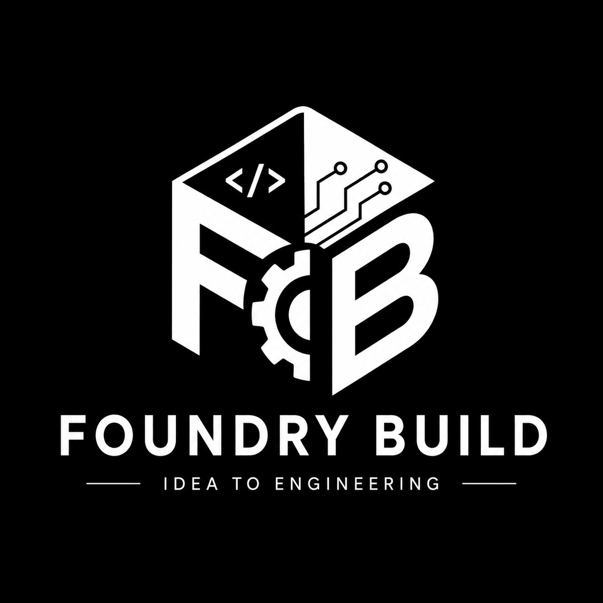
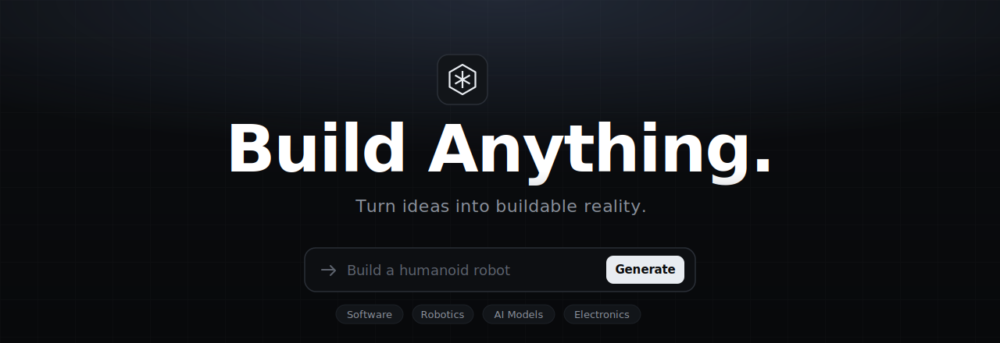

<div align="center">





<h1>FoundryBuild</h1>

### Your AI CTO. From idea to engineering blueprint in minutes.

*Describe what you want to build. Get a complete technical plan, architecture, roadmap, cost breakdown, and risk analysis — generated by 11 specialized AI agents working in parallel.*

<p>
  <a href="https://foundrybuild.xyz"></a>
  <a href="https://github.com/VatsalyaBhadaurya/Foundry-Build/stargazers"></a>
</p>

<p>
  
  
  
  
  
  
</p>

</div>

---

## What is FoundryBuild?

> **Ideas are easy. Building is hard.**

Most people know *what* they want to build but get stuck on where to start, what's needed, how much it costs, and whether it's even feasible. FoundryBuild solves this with an AI CTO that interviews you about your project, then deploys **11 specialized agents in parallel** to generate a complete engineering blueprint.

```
"Build an AI-powered delivery drone"
        ↓  CTO Interview (5–8 turns)
        ↓  11 agents run in parallel + sequentially
        ↓  Full engineering blueprint ready in < 2 min
```

---

## How It Works

### Phase 1 — CTO Interview
An AI CTO interviews you with targeted questions to understand your idea, budget, timeline, team size, deployment target, and constraints. Takes 5–8 turns.

### Phase 2 — 11 Agents Deploy

| # | Agent | What it does |
|---|-------|-------------|
| 1 | **Planner** | Breaks the project into subsystems and milestones |
| 2 | **Architecture** | Designs 3 system variants: Budget / Balanced / Premium |
| 3 | **GitHub** | Finds the most relevant open-source repos and libraries |
| 4 | **Research** | Surfaces academic papers and prior art |
| 5 | **Budget** | Generates a full Bill of Materials with cost estimates |
| 6 | **Roadmap** | Builds a phased development timeline |
| 7 | **SkillGap** | Identifies skills needed and learning resources |
| 8 | **Risk** | Maps technical, financial, and operational risks |
| 9 | **DevilsAdvocate** | Stress-tests the plan — finds flaws, wrong assumptions, simplifications |
| 10 | **Blueprint** | Synthesizes everything into the final engineering document |
| 11 | **Interview** | Drives the CTO conversation and extracts structured requirements |

Agents 1–8 run **in parallel**. DevilsAdvocate runs after, then Blueprint synthesizes everything.

### Phase 3 — Blueprint Export
Export your blueprint as **PDF**, **Markdown**, or **GitHub README**.

---

## Blueprint Sections

The generated blueprint includes **9 tabs**:

| Tab | Content |
|-----|---------|
| Overview | Executive summary, objectives, assumptions, constraints |
| Architecture | System design, tech stack, 3 design variants |
| Roadmap | Phased milestones with deliverables and success criteria |
| Costs | Bill of Materials, cost breakdown per variant |
| Risks | Risk matrix with likelihood, impact, and mitigations |
| Skills | Skill requirements, gaps, and learning resources |
| Resources | GitHub repos + research papers |
| Critique | Devil's Advocate stress-test findings |
| Feasibility | 6-dimension scoring: technical, commercial, innovation, complexity, scalability, maintainability |

---

## Project Numbers

| Metric | Value |
|--------|-------|
| AI Agents | **11** |
| Orchestration Phases | **3** |
| Blueprint Tabs | **9** |
| API Endpoints | **11** |
| Export Formats | **3** (PDF, Markdown, README) |
| Lines of Code | **~13,000** |
| Python Files | **40** |
| React Components | **18** |

---

## Tech Stack

### Frontend
- **Next.js 16** (App Router) — deployed on Vercel
- **React 19** + **TypeScript** strict mode
- **Tailwind CSS v4** with custom dark design system
- **Framer Motion** for reduced-motion-aware animations

### Backend
- **FastAPI** + **Python 3.14** — deployed on Render
- **Google Gemini** via `google-genai` SDK with structured output
- **asyncio.Semaphore(3)** for rate-limit-aware concurrent LLM calls
- **SSE (Server-Sent Events)** for real-time agent progress streaming
- **Supabase** for persistence (in-memory fallback for local dev)
- **fpdf2** + **markdown2** for PDF generation

---

## Quick Start

### Frontend

```bash
git clone https://github.com/VatsalyaBhadaurya/Foundry-Build.git
cd Foundry-Build
npm install
npm run dev
# → http://localhost:3000
```

### Backend

```bash
cd backend
pip install -r requirements.txt

# create .env
cp .env.example .env
# add your GEMINI_API_KEY to .env

uvicorn main:app --reload
# → http://localhost:8000
```

### Environment Variables

**Backend `.env`**
```env
GEMINI_API_KEY=your_key_here
SUPABASE_URL=               # optional — uses in-memory if blank
SUPABASE_KEY=               # optional
CORS_ORIGINS_STR=http://localhost:3000
```

**Vercel (frontend)**
```
NEXT_PUBLIC_API_URL=https://api.foundrybuild.xyz
```

---

## Project Structure

```
Foundry-Build/
├── app/
│   ├── layout.tsx
│   ├── page.tsx
│   ├── studio/
│   │   ├── page.tsx              # idea input
│   │   └── [id]/page.tsx         # interview → agents → blueprint
│   └── globals.css
├── components/
│   ├── Nav.tsx                   # rolling stats + centered nav
│   ├── Hero.tsx                  # typewriter + GitHub CTA
│   ├── studio/
│   │   ├── InterviewPanel.tsx    # CTO chat UI
│   │   ├── OrchestrationPanel.tsx # 10-agent progress tracker
│   │   └── BlueprintPanel.tsx    # 9-tab blueprint viewer
│   └── ...
├── lib/
│   └── api.ts                    # typed API client
└── backend/
    ├── agents/                   # 11 agent modules
    │   ├── interview/
    │   ├── planner/
    │   ├── architecture/
    │   ├── github/
    │   ├── research/
    │   ├── budget/
    │   ├── roadmap/
    │   ├── skill_gap/
    │   ├── risk/
    │   ├── devils_advocate/
    │   └── blueprint/
    ├── api/v1/endpoints/         # FastAPI routes
    ├── shared/
    │   ├── llm.py                # Gemini client + retry + semaphore
    │   └── schemas.py            # Pydantic models
    └── main.py
```

---

## Deployment

| Service | Platform | URL |
|---------|----------|-----|
| Frontend | Vercel | `https://foundrybuild.xyz` |
| Backend API | Render | `https://api.foundrybuild.xyz` |

---

## The Vision

> **A universal operating system for builders.**

FoundryBuild is evolving toward a future where anyone can describe an idea and receive the knowledge, architecture, planning, and execution framework needed to bring it into existence — whether that's a SaaS product, a humanoid robot, an AI model, or a satellite.

---

<div align="center">

Built by [Vatsalya Bhadaurya](https://github.com/VatsalyaBhadaurya) · [LinkedIn](https://www.linkedin.com/in/vatsalya-bhadaurya/) · [vatsalya@nextgenrl.com](mailto:vatsalya@nextgenrl.com)

A product of **Nextgen Research Lab And Infrastructure Development Pvt Ltd**

**[foundrybuild.xyz](https://foundrybuild.xyz)**

</div>
